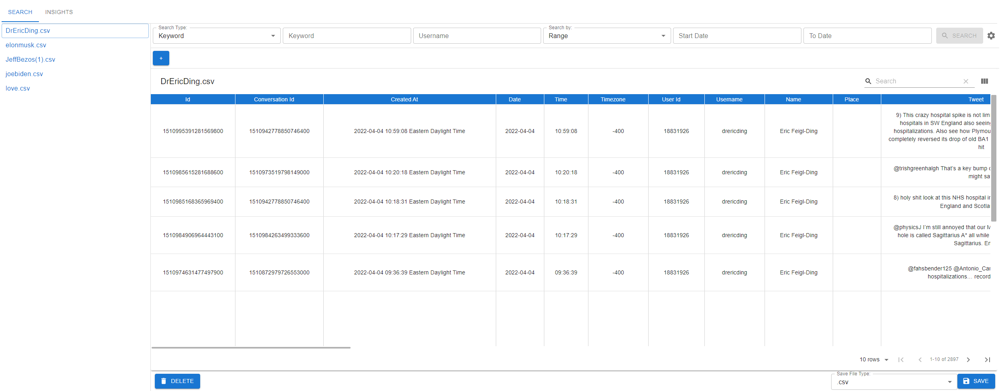

# Intelligent Scraping with Python (ISpy) User Installation Guide

## 1. Download Installer
Click one of the links below to download the installer for you operating system

Windows: [Windows Installer download](https://github.com/JIE-1350/ISpy/raw/development/installer/Windows/ISpy%20Setup%201.0.0.exe)

[//]: # ([IOS Installer download]&#40;url&#41;)

Linux: [Linux Installer download](https://github.com/JIE-1350/ISpy/raw/development/installer/Linux/ISpy-1.0.0.AppImage)

IOS: Currently not available. Click [here](https://github.com/JIE-1350/ISpy#installation) for instructions to install from scratch.

If a download was not initiated after clicking the link, follow these instructions to download:
* Open the `installer/` folder
* Select the folder of your operating system
* Click on the installer file and then click on download

## 2. Install the application to your machine
To install the application follow these instructions:
* Find the downloaded file. This should normally be in your computer download folder.
* Open the file. This will run an installer and will take care of everything for you.
* Once the installation is completed, the application will launch.

## 3. Done
* You can start searching and scraping data.
* There should a desktop for you to launch the application when you need to open it.
* The application should look like the images below

### Search Tab

### Insight Tab

## Uninstalling the application
Like any program on Windows you can uninstall in Control Panel > Program > Programs and Features.
You can access that window using these steps
* Hit the Windows key and type "ISpy". The application will show up after the search.
* Left-click on the application and click "Uninstall"
* To uninstall, double-click on the program you want to uninstall and click "Ok"

