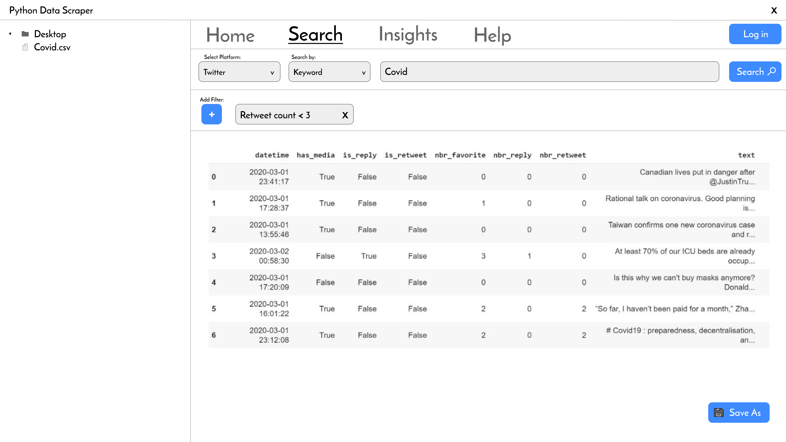

# temp

## Installation
### Frontend
I recommend installing nodeJS 16.13.0 (LTS)

For npm, the lastest version works for me

```cd frontend/```

```npm install```

```npm run dev```

### Backend
I recommend creating a virtual environment first then run these commands to install dependencies:

```pip install -r requirements.txt```

or

```pip install twint```

```pip install --upgrade -e git+https://github.com/twintproject/twint.git@origin/master#egg=twint```

To run manually:

```python server.py```

```http://localhost:8000/?user=joebiden&keyword=covid&since=2021-01-1&until=2022-01-1```

## Prototype


