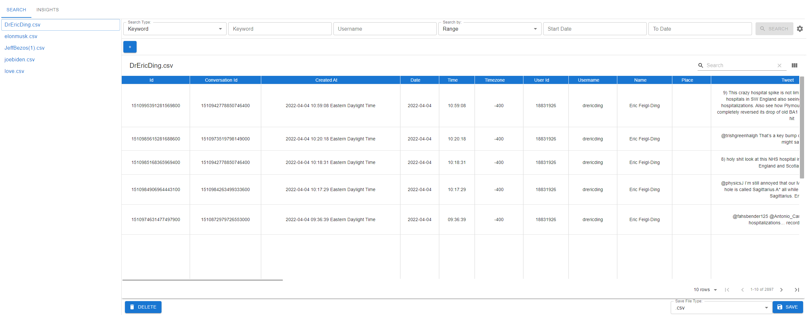
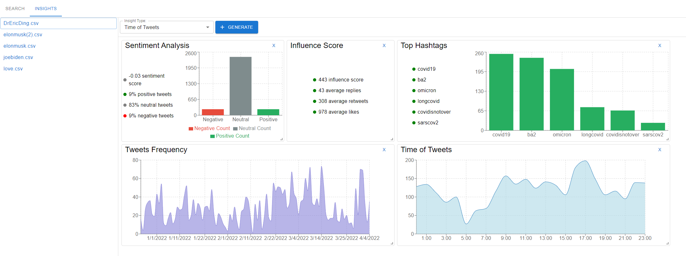

# Intelligent Scraping with Python (ISpy)

The main goal of this project is to provide an easy user interface to decrease time spent searching the web or building out custom scraping tools, and increase time spent studying and analyzing trends. The collection of information will enable various users (such as social scientists and academics) to view top trends, identify solutions, and perform insight analysis. Looking at the significant impact social media has had on the 21st-century global society, we can see how easily and quickly misinformation can spread through platforms such as Twitter. This misinformation can lead to a significant amount of divisive and harmful opinions. For example, this past year of the global pandemic has shown how misinformation such as conspiracy theories about COVID-19 vaccines can quickly spread and lead to harmful effects like preventing many people from getting vaccinated. Using our Python-powered Scraper, users will be provided with accurate and unbiased data; as a result, allowing for the common benefit of society. Some of the key features within our application will be collecting data from Twitter, applying filters to sort and organize data, providing various insights on collected data, and saving collected information for later use.

## Download Installer
[Windows Installer download](https://github.com/JIE-1350/ISpy/raw/development/installer/Windows/ISpy%20Setup%200.1.0.exe)

[IOS Installer download](url)

[Linux Installer download](url)

### Search Tab


### Insight Tab


## Release Notes
### Version 1.0.0:
#### New Features
* Scrape data from Twitter by keyword, hashtag, userid, or recent tweets
* Ability to cancel a search
* Visualize Data in a formatted Table organized by row for each tweet and column for tweet properties
* Filter data using interactive user interface
* Apply multiple filters or filter by keyword/number of likes
* Search table by keyword/value using table search bar
* Sort the table alphanumerically by clicking on column headers
* View previously saved data files or open them from directory sidebar
* Auto generate readable file name
* View table name as name of file
* Save data (filtered or not) as .csv, .json, or .xlsx (Excel) on your local machine
* Added support for reading other file types such as .csv, .json, or .xlsx
* Ability to remove/delete the current file
* Ability to create customizable insights dashboard in Insight Tab
* Perform Sentiment Analysis insight
* Provide Influence Score insight for user
* View Top Hashtags List insight
* View Top Hashtags Graph insight
* View Time of Tweets insight
* View Frequency over Time insight
* View Insight Documentation in tooltip
* Capability to install using compiled Installer
* Ability to adjust Advanced User Settings
* Improved application UI is intuitive and easy to understand with icons added to buttons


#### Bug Fixes
* Fixed React build script failing to load files
* Fixed Insight Tab not updating when Search is completed
* Fixed 'Save As' drop box not updating
* Fixed chart domain and type for Insights

#### Known Issues
* Sometimes switching to the Search Tab takes a long time; moderate
* Potential problem with incorrect filter value data type; moderate
* Some datasets generate graphs with text that are cutoff at default size, but are easily resized; minor

## Installation
### Frontend
#### Requirements
* [nodeJS 16.13.0 or newer (LTS)](https://nodejs.org/en/)
* [npm 8.5.0 or newer (comes bundled with node)](https://www.npmjs.com/package/npm/v/8.5.0)

#### Setup

```cd frontend/```

```npm install```

#### Run frontend only
```npm start```

#### Run frontend and backend
```npm run dev```

### Backend
#### Requirements
* [Python 3.8](https://www.python.org/downloads/release/python-380/)
* [pip 22.0.0 or newer](https://pip.pypa.io/en/stable/cli/pip_install/)

#### Setup
Create a virtual environment and install the dependencies:

```cd backend/```

```python3 -m venv venv```

* If on Windows:
```source venv/scripts/activate```
* If on Linux/Mac:
```source venv/bin/activate```

```pip install -r requirements.txt```


#### Run manually for developing:

```python server.py```

## Build Installer
Before you start building the installer, make sure that you can run the application in development setting.

Make sure that your virtual environment is activated, and **pyinstaller** is installed.

Create an executable for the python server.

To start, change directory to `backend/pyinstaller/`

`cd backend/pyinstaller/`

Run the sh script to create the executable for the flask server. 

`sh create_exe.sh`

The executable should be in `backend/pyinstaller/dist/` folder with the name `server.exe`

There should also be a copy of `server.exe` in `frontend/`.

Change directory to `frontend/`

`cd ../../frontend`

Run the script to build the electron application installer

`npm run electron:build`

The installer should be in `frontend/dist/` folder as `ISpy Setup 0.1.0.exe`

## Troubleshooting
### Problem #1
  The application fails to load data file and table.

Cause: 
  + The settings file is corrupted or wrong.

Solution 1:
  + Go to settings.
  + Click reset button.
  
Solution 2:
  + Go to backend folder.
  + Delete settings.json.
  + Reload the app.

### Problem #2
  The application fails to load the search tab.

Cause: 
  + There may be corruption or wrong format in a data file.
  
Solution:
  + Go to backend\data folder.
  + Delete the corrupted/wrong format data files.
  + Restart the app.
  
### Problem #3
  Cannot generate an insight for a data file.

Cause: 
  + The insight already exists for this data file.
  
Solution:
  + Delete the current insight.
  + Generate it again.
  